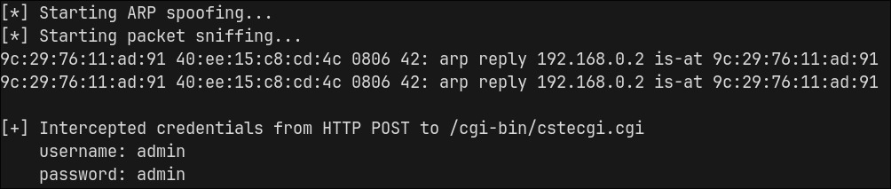

# TOTOLINK-A720R

## Submitter: Nicola Giuffrida

## Information


**Vendor:** TOTOLINK

**Vendor's website:** [TOTOLINK](https://www.totolink.net/)

**Model:** A720R

**Firmware version:** V4.1.5cu.630_B20250509

**Firmware download address:** [TOTOLINK](https://www.totolink.net/home/menu/detail/menu_listtpl/download/id/203/ids/36.html)


## Vulnerability details

When logging into the control panel, the username and password are sent in plain-text:

```
POST /cgi-bin/cstecgi.cgi HTTP/1.1
Host: 192.168.0.1
Content-Length: 73
X-Requested-With: XMLHttpRequest
Accept-Language: en-US,en;q=0.9
Accept: application/json, text/javascript, */*; q=0.01
Content-Type: application/x-www-form-urlencoded; charset=UTF-8
User-Agent: Mozilla/5.0 (X11; Linux x86_64) AppleWebKit/537.36 (KHTML, like Gecko) Chrome/140.0.0.0 Safari/537.36
Origin: http://192.168.0.1
Referer: http://192.168.0.1/login.html
Accept-Encoding: gzip, deflate, br
Connection: keep-alive

{
  "username":"admin",
  "password":"admin",
  "flag":"0",
  "topicurl":"loginAuth"
}
```
An attacker can intercept and use the credentials to obtain admin access to the router.

## POC

Run the poc.py
```
sudo python3 poc.py <interface> <victim_ip> <repeater_ip>
```

Log in the control panel


The script will intercept and print the credentials




